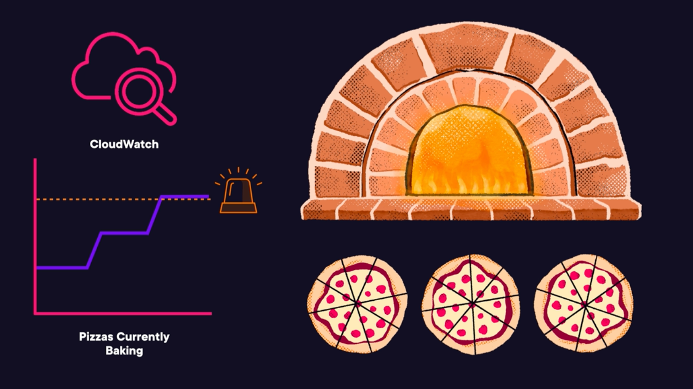
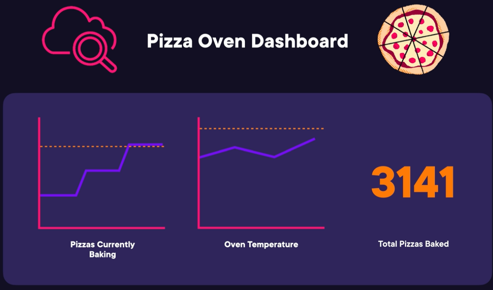
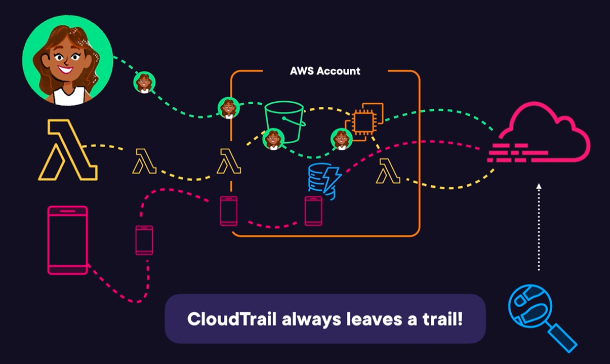

# Auditing, Monitoring, Logging, and Additional Technology and Services
- Introducing Monitoring and Logging on AWS
- Exploring Amazon CloudWatch and AWS CloudTrail
- Managing Many Resources on AWS
- `HANDS-ON LAB` Visualize Metrics for Tagged Resources on Amazon CloudWatch
- Monitoring Service Health and Best Practices
- Understanding Auditing on AWS
- Identifying Business and End User Services
- Auditing, Monitoring, and Logging Exam Tips

## Introducing Monitoring and Logging on AWS

In this lesson, we will explore key concepts and practices related to monitoring and logging in AWS, focusing on metrics, logs, and configurations. We'll cover the importance of collecting metrics, the sources of logs, and the role of configuration management. We will also relate these practices to the AWS Well-Architected Framework and provide some tips for the exam.

### Key Resources in Monitoring and Logging
- **Metrics**: Numerical representations of things like capacity and demand, tracked over time.
- **Logs**: Records of actions that occur in services or on your AWS account, helping to derive metrics and enhance security.
- **Configurations**: Settings or guidelines applied across cloud resources to enforce best practices and maintain security.

 

### Collecting Metrics
- **Purpose**: To monitor workload health, optimize resource utilization, and inform design decisions.
- **Examples**:
  - Number of Lambda invocations or errors
  - CPU utilization on EC2 instances
  - RDS read latency
- **Benefits**:
  - **Visualization**: Create charts for human interpretation and decision-making.
  - **Alerts**: Receive notifications when specific events occur (e.g., CPU utilization > 80%).
  - **Automation**: Trigger automated actions based on metric thresholds.

 

### Log Producers
- Metrics are derived from logs
- Logs track actions on your infrastructure
- **Types of Logs**:
  - VPC Flow Logs
  - EC2 Instance Logs
  - Account Activity Logs
  - Application Logs
- **Security Use**:
  - Track actions by both humans and automated processes.
  - Investigate security events by inspecting logs to identify who or what made critical changes.

 

### Configuration Management
- **Definition**: 
  - Configurations are resource settings or standards
  - Types and properties of resources can be standardized across your AWS environment
- **Importance**:
  - **Security**: Ensure IAM users use MFA, make resources private to prevent unauthorized access.
  - **Monitoring**: Detect and enforce adherence to configurations.
- **Automation**: Necessary for managing configurations at scale, especially with a large number of resources.

> **Configurations Require Monitoring** Standardizing configurations requires both prevention and detection

> **Automate Configurations at Scale** We will be leveraging AWS services to automate enforcement and auditing of configurations

### Well-Architected Framework
The Well-Architected Framework consists of six pillars: security, cost optimization, performance efficiency, operational excellence, reliability, and sustainability. Monitoring and logging are essential to achieving these pillars:
- **Security**: Tracking actions across your resources is integral to security on AWS.
- **Cost Optimization**: Understanding the utilization of your provisioned resources through metrics is key to cost optimization.
- **Performance Efficiency**: Metrics can help you ensure your workloads are fast and responsive.
- **Operational Excellence**: Auditing configurations and collecting appropriate logs and metrics contribute to operational excellence.
- **Reliability**: Visibility into the uptime and performance of your workloads is integral to reliability.
- **Sustainability**: Metrics can help you more closely track your carbon footprint on AWS.

 

## Exploring Amazon CloudWatch and AWS CloudTrail

### CloudWatch vs CloudTrail

|CloudWatch|CloudTrail|
|---|---|
|Gives **visibility** to cloud rsources and appications|Provides **accountability** for actions taken in your account|
|Tracks metrics in **dashboard**|**Centralizes** activity logs accross regions in an `S3 bucket`|
|Stores logs from **many sources**|Tracks only **API activity** in your AWS account|
|Trigger events with **`CloudWatch` alarms**|`CloudTrail` creates a **trail of breadcrumbs** for any action in your account|
|`CloudWatch` lets you **watch** your cloud resources as your AWS ecosystem evolves||

 

> **Pro Tip**
> 
> For EC2, application and some instance metrics can't be collected unless you install the `CloudWatch Agent` on the instance
>
> Metrics Requiring CloudWatch Agent:
> - Free Memory
> - Percentage of Disc Space used
> - Custom Application Metrics
> - Many more

 

### Usage examples:
#### CloudWatch
Imagine Pizza restourant monitoring pizza oven for number of pizzas. In this example oven (resource) has capacity of maximum 3 pizzas and alarm is triggered whenever the maximum capacity is reached.

You can also build a dashboard to include additional metrics:

 

#### CloudTrail
Now imagine that one day pizzas start coming out burned, and you need to trace back the steps to find the root casuse for this issue. This is where CloudTrail helps you trace back the steps taken by each authorized person that could cause the issue:

> In AWS it is not just a specific user action that can lead to issue, but also resources connected to application. CloudTrail helps you to identify issues by tracking activity by each user and service
> 

