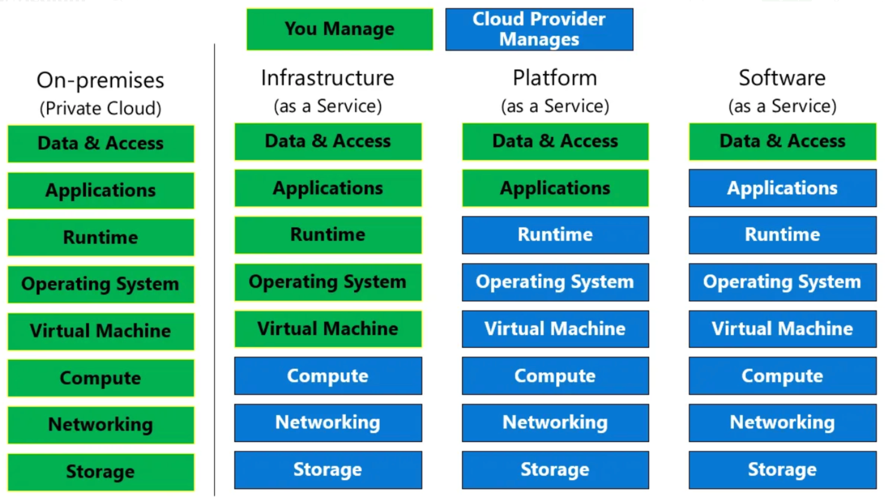

# CHAPTER 2 ***Foundations of Cloud Computing***
- Getting Your Head in the Cloud
- Introducing Cloud Computing and Deployment Models
- Exploring Regions and Availability Zones
- Reviewing Edge Locations and Local Zones
- Introducing the Frameworks
- Meeting the AWS Management Console and Accessing AWS
- Demo: Exploring Your Amazon Web Services (AWS) Account
- Foundations of Cloud Computing Exam Tips

## Getting Your Head in the Cloud

### What is the cloud?

**Cloud Computing**

Cloud computing is a technology that allows users to access and store data, run applications, and perform computing tasks over the internet, rather than on local servers or personal computers. It provides on-demand availability of computing resources such as servers, storage, databases, networking, software, and analytics. Cloud services are typically offered by providers like Amazon Web Services (AWS), Microsoft Azure, and Google Cloud Platform, which manage the underlying infrastructure and provide scalable, flexible, and cost-effective solutions.

**Virtualization in Cloud Computing**

Virtualization is a key technology in cloud computing that optimizes the utilization of servers. It involves creating virtual versions of physical hardware, such as servers, storage devices, and network resources. By using virtualization, multiple virtual machines (VMs) can run on a single physical server, each operating independently and with its own operating system and applications. This maximizes resource efficiency, as it allows for better allocation and management of computing power, reduces hardware costs, and enhances scalability and flexibility. Virtualization also improves disaster recovery and simplifies IT management, contributing to the overall effectiveness and reliability of cloud services.

 

### Introducing Cloud Computing and Deployment Models
#### Capital expenditures (CapEx)
Capital expenditures are the upfront purchases towards fixed assets

#### Operating Expenses (OpEx)
Operating expenses are funds used to run day-to-day operations

 

### Cloud computing advantages
- Global in minutes (easy and fast setup)
- No Data center purachasing/investment
- Economies of scale (pricing of services provided by cloud providers)
- Speed and agility
- Stop guessing capacity (Cloud elasticity)
- CapEx for variable Expense

### Cloud computing benefits
- High Availability
- Elasticity Easy to automate or manually add additional resources when required
- Agility All the services you have available to you, make you inovate faster
- Durability Long-term data protection
  
### Cloud Computing Models

