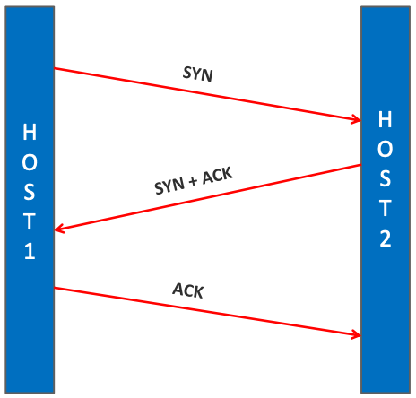

# Networking

### Topic
- OSI Layers
- Protocols
- DNS
- ICMP
- Packet Capturing Tools
- Linux Firewalls
- Iptables
- Linux Security

### Objectives
- Understand about OS model
- Learn about various protocols
- Understand about Packet Capturing tools
- Learn about Linux firewalls
- Know more about Linux Security

## OSI Layers
- Open system Connection (OSI) is a model for how various application will interact over a network.
- It divides the architecture in seven segments.
- The lower layer deals with chunks of binary data and routing these data.
- Higher levels are responsible for network requests, network representation and protocol's as seen from a user's point of view.
- Each layer interacts with the layer above and below it.

|Layer|Description|
|---|---|
|**Application**|To allow access to network layers. Example - FTP, HTTP, DNS, SNMP|
|**Presentation**|To translate, encrypt and compress data.|
|**Session**|Establish, manage and terminate session.|
|**Transport**|Reliable process to process message delivery and error recovery. Ex - TCP, UDP|
|**Network**|Move packets from source to destination. Ex -IP, ICMP, ARP|
|**Data Link**|Organize bits into frame to provide hop-to-hop delivery.|
|**Physical**|To transfer bits over an electrical medium.|

 

## Protocols
### TCP
- Transmission control protocol which delivers data from end-to-end in order, reliably.
- It establishes a virtual path between source and destination.
- It uses the underlying layer to deliver individual segments but control is with itself, and IP is unaware of the re-transmission or out-of-order packets.
- Each TCP port is bound to at most one socket, avoiding duplication.

#### TCP Features
|Feature|Details|
|---|---|
|**Maximum segment size**|This is shared between both parties and is tha largest amount of data in bytes to be sent in one single segment|
|**Rate Limits**|The rate a sender sends data to guarntee reliable data|
|**Ordered data transfer**|It sends data as stream of bytes with numbering|
|**Retransmission of lost data**|It uses an acknowledgment mechanism to check arrival of data. Error free data transfer. Error control is received through checsum, acknowledgment and time out.|
|**Congestion control**|Data sending rate also depends on the congestion of the network|

#### TCP Connection Establishment

- **SYN** It is synchronization for the sequence numbers. It carries one sequence number. No data is present.
- **SYN + ACK** SYN for communication in other direction and ACK for received SYN. It consumes one sequence number.
- **ACK** ACK segment for received SYN. It doesn't consume any sequence number.

 

### UPD
- User Datagram Protocol have a fixed size header of 8 bytes.
- Prior communications are not required to set up a communication channel.
- It has no hand-shaking, so it is unreliable. Hence, there is no guarantee of delivery.
- UD avoids the overhead of protocol processing like error detection.
- Time-sensitive application often use UDP where dropping packet is a better choice than waiting for the packet to be retransmitted.
- Live broadcast, multi-player games generally use UDP.

#### UPD Features
- No connection establishment is done. Data is sent right away.
- Packates are sent individually and checked when received.
- UPD does not avoid cingestion and it needs to be taken care at the application level.
- The messages are not ordered.
- It is very lightweight and fast.
- It is useful for broadcast as connection establishment is not required. 

 

### IPv4
- Internet Protocol version 4 is used to identify devices on a network through an addressing system.
- It is a connectionless protocol used on a packet switched network.
- It fragments packets when required.
- Ipv4 address is a 32-bit address uniquely defines the connection of a device universally.
- It doesn't g uarantee end to end message reliability or flow control.

#### IPv4 Address
- IPv4 are 32 bit integer and most commonly written in 4 octets with dot separated integer values.
- IP address has the format <Network><Host>
- Some of the numbers like 0.0.0.0 and 255.255.255.255 are reserved for default gateway or broadcast IP.
- The network part is centrally administered by InterNIC and is unique through out the Internet.

#### Issues with IPv4
- No encryption of data is done in packets.
- IP packet can be easily sniffed from a network.
- Most of the networks have already been assigned and there is a resource crunch.
- Ipv4 doesn't implement quality of service functionality.
- No authentication of user done at the server.
- Maximum packet size is of 65,535 bits which is smaller compared to the new faster networks.

 

### IPv6
- IPv6 is the sixth revision to the Internet Protocol and follows IPv4.
- It has long addresses of 128 bits. It supports billion of users now.
- Simplified fixed size headers to process packets faster.
- Support for authenticity and privacy.
- Flow control and quality of service provides high reliability.
- Encryption headers allows better security of data.
- Extension headers allows large packet sizes.
- Standard authorization of users to server.

 

### FTP
- File Transfer Protocol is standard protocol to transfer file over a computer network.
- It is built on client-server model and uses separate data and control connections.
- FTP is a two-way system. Transferring file from client to server is called uploading and from server to client is called downloading.
- In Unix, the service is provided by a daemon called ftpd which runs in background.
- It allows to have ownership and access restrictions.
- Come FTP client tools are Filezilla, dreamweaver, etc.

