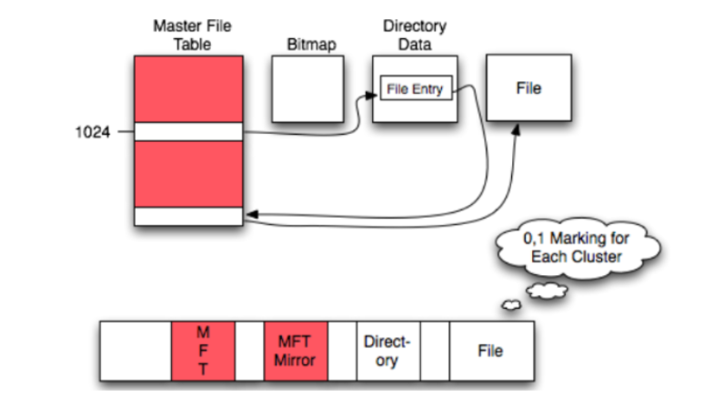

# User Administration

### Topics
- File Systems and its Types
- Software Package Management
- Users in Linux
- User Groups in Linux
- File/Folder Permissions
- Special Permissions

### Objectives
- Understand File System in the OS
- Learn Packaging Management in Linux
- Understand where user information is stored
- Use Commands to Add a New User, Delete a user, Modify User and Change Password
- Use Linux Group Mechanism to Organize a Collection of Users
- Manage Permissions for Files and Directories

## File System
The file system is a logical arrangement to store and retrieve data

- The file system can be local data storage via a network protocol or virtual files
- Most of the file systems use hard disks which are made of small fixed size blocks. Each block has an identifier to describe the start and end of the block
- Depending upon the file system architecture, file fragmentation occurs when some files are in noncontiguous clusters or some file are deleted
- Each file has a metadata consisting of size, date and time of creation, file type, access permission, owner of a file, etc.

### Type of file systems

- **Disk File System**
  
  It manages data on a permanent storage device. Accessing the data for multiple request can be handled Ex - NTFS, FAT, etc.

- **Network File System**

  It allows a user on a client computer to access the files over a computer network using NFS protocol Ex - AFS, SMB

- **Special Purpose File System**

  The system API/device is given a file type representation to use according with Unix OS

  

### Examples of File Systems

- **FAT**

  - File Allocation Table (FAT) uses indexing for a contiguous area of disk store
  - Each entry has index of the next cluster or indicates end of the file
  - The top directory has a number of clusters of each file in the particular directory
  - FAT may lead to fragmentation and has better alternatives for larger file systems

    

  **Comparison of FAT versions**

  |Attribute|FAT12|FAT16|FAT32|
  |---|---|---|---|
  |Used For|Floppies, small hard drives|Small to large hard drives|Large to very large hard drives|
  |Size of each FAT entry|12 bits|16 bits|28 bits|
  |Maximum number of Clusters|~4,096|~65,536|~268,435,456|
  |Supported cluster size|512 B to 4 KB|2 KB to 32 KB|4 KB to 32 KB|
  |Maximum volume size|16,736,256B (16MB)|2,147,123,200B (2GB)|~2^41B (2TB)|
  
  - There are multiple version of FAT like FAT 12, FAT 16, FAT 32 with FAT 32 more suited for device with larger memory chunks
  - It is best suited for file system of smaller sizes and primarily used in floppies, cameras, media players, etc.

  

- **NTFS**

  **N**ew **T**echnology **F**ile **S**ystem (NTFS) uses advanced data structure to improve performance, reliability and disk space usage

  - Each file operation is broken down into transaction so that recovery is allowed
  - Whenever it is needed each file or folder can be expanded or compressed automatically

  

  **NTFS - Features**
  |Feature|Description|
  |---|---|
  |**Self Healing NTFS**|Detects and corrects corrupted NTFS volume file|
  |**ACL(Access Control List)**|Determines who else can access or modify your files|
  |**File level encryption**|Protects your file content from unauthorized access|
  |**Disk Quotas**|It keeps track of disk space being used and enables administrator to limit disk space that a user may use|
  |**Reliable File System**|Automated recovery operations and checks for consistency by using transaction log and journal file|
  |**File Compression**|Compression of large file is allowed so that disk space is used efficiently|

  

- **ext4**

  - Fourth Extended File System (ext4) is designed for Linux Kernel
  - It supports huge individual file size and go to TB's and almost one directory can contain 64,000 sub-directories

  

  **Features**
  - Less chances of file corruption during a crash and transparent encryption is supported
  - When data is copied to disk, it supports delayed allocation and create blocks
  - There are very low chances of fragmentation in ext4
  - It is faster as it skips the unallocated blocks reducing the retrieval time

