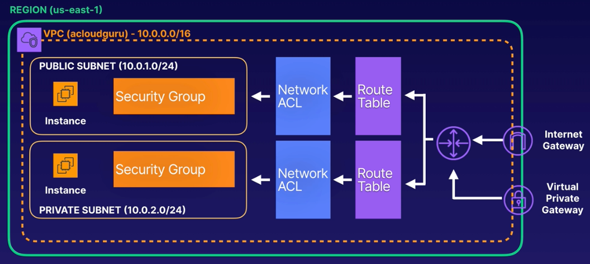

# CHAPTER 7 Networking and Content Delivery

### Chapter Outline 
- Section Introduction
- Virtual Private Cloud (VPC) Overview
- `Demo` Building Your Own Custom VPC - Part 1
- `Demo` Building Your Own Custom VPC - Part 2
- `Demo` Building Your Own Custom VPC - Part 3
- `HANDS-ON LAB` Creating a Basic VPC and Associated Components in AWS
- `Demo` Configuring Network ACLs - Part 1
- `Demo` Configuring Network ACLs - Part 2
- `Demo` Connecting to an EC2 Instance Using Systems Manager Session Manager
- `Demo` Introducing VPC Endpoints
- `HANDS-ON LAB` Create a VPC Endpoint and S3 Bucket in AWS
- Understanding VPC Peering
- Securely Connecting to a VPC Using a Virtual Private Network (VPN)
- What Is Direct Connect?
- Understanding VPC Flow Logs
- `Demo` Using VPC Flow Logs
- `HANDS-ON LAB` Work with AWS VPC Flow Logs for Network Monitoring
- Introducing Domain Name System (DNS)
- Introducing Route 53
- Exploring Route 53 Resolver
- Understanding Route 53 Routing Policies
- `Demo` Route 53 Simple Routing Policy
- `Demo` Route 53 and Weighted Routing Policy
- `Demo` Route 53 Failover Routing Policy
- `Demo` Route 53 Geolocation Routing Policy
- `Demo` Configuring Route 53 Alias
- Understanding Route 53 Failover Alias Records
- `Demo` Configuring Route 53 Failover Alias Records
- Overview of CloudFront
- `Demo` Configuring Amazon CloudFront
- `Demo` Configuring Amazon CloudFront with Origin Access Control
- `Demo` Interpreting CloudFront Logs
- Identifying CloudFront Caching Errors
- CloudFront Cache Hit Ratio
- Advanced CloudFront
- Improving CloudFront Cache Hit Ratio When Forwarding Request Headers and Cookies

   

## Section Introduction
- Domain 5 of the Exam Guide
- Building Your Own Custom VPC
- VPC Flow Logs
- VPNs and Direct Conenct
- DNS and Route 53
- CloudFront

   

## Virtual Private Cloud (VPC) Overview
### VPC Introduction
- Think of VPC as a virtual data center in the cloud
- Logically isolated part of the AWS Cloud where you can define your own network, and install your own resources
- Have complete control of the virtual network including your own IP address range, subnets, route tables, and network gateways.

 

### Networking
- **Fully Customizable Network**
  - Enables multi-layered security, using network access control lists (network ACLs) and security groups, to control access to the EC2 instances in your subnets.
  - Example 3-tier architecture:
    

 

### VPNs
- Additionally, you can establish a **hardware Virtual Private Network (VPN)** connection between your own data center and your VPC. This enables you to utilize the Cloud as an extension of your own data center.
- VPN allow you to establish secure, private, encrypted tunnel between your data center and AWS.

 

### Network Diagram
- **VPC with Public and Private Subnet(s)
    

> In example above access to the Private subent is only allowed from VPN connection

 

| AWS Recommended Internal CIDR Ranges |
|---|
|10.0.0.0 - 10.255.255.255 (10/8 prefix)|
|172.16.0.0 - 172.31.255.255 (172.16/12 prefix)|
|192.168.0.0 - 192.168.255.255 (192.168/16 prefix)|

> Use  to check your CIRD ranges

 

### VPC Features
- **Launch Instances** Launch instances into a subnet of our choosing
- **Custom IP Addresses** Assign custom IP address ranges in each subnet
- **Route Tables** Configure route tables between subnets
- **Internet Gateway** Create an internet gateway and attach in to our VPC
- **Control** Control which networks can access our AWS resources
- **Security Mechanisms** Network Access Control Lists. Security Groups.

 

### Comparing VPCs
|Default VPC|Custom VPC|
|---|---|
|Default VPC is user friendly|Fully customizable|
|All subnets in default VPC have route out to the internet|You can configure the way you want|
|Each EC2 instance has both public and private IP address|You decide if subnets will be public or private|
||Takes time to set up|

   

## Understanding VPC Peering
### What is VPC Peering?
**VPC Peering** allows you to route traffic between 2 VPCs using private IP address:
    - Enables EC2 instances in one VPC to communicate with instances in another
    - Instances behave as if they were on the same private network
    - The VPCs do not need to be in the same account or AWS Region
> VPCs must have different IP ranges and not have duplicate IP addresses

 

### How it Works

> Connectivity has to be explicitly enables between VPC X and VPC Y, as other VPC cannot be configured as tranceivers

   

## Securely Connecting to a VPC Using a Virtual Private Network (VPN)
### **What is a Site-to-Site VPN?**
- **VPN (Virtual Private Network)**: A secure connection between on-premises networks, remote offices, client devices, and AWS resources.
- **AWS Site-to-Site VPN**:
  - Creates an encrypted tunnel between your **network** and **VPC**.
  - Uses **IPsec (Internet Protocol Security)**, an industry-standard protocol for encrypting communications between two devices.
  - Provides secure communication over the **internet**.

#### **Components Required for Configuration**
1. **Virtual Private Gateway (AWS Side)**:
   - Configured within your **VPC**.
   - Acts as the entry point to your VPC for VPN connections.

2. **Customer Gateway Device (On-Premises Side)**:
   - Located in your **data center** or **remote office**.
   - Can be a physical device or a virtual software appliance.
   - Common vendors: Cisco, Fortinet, Palo Alto, Juniper, Netgate, etc.
   - Must support the **IPsec protocol**.

 

### **Example Use Case**
- **Scenario**: Connecting a corporate data center to an AWS VPC.
1. Deploy a **Virtual Private Gateway** in the VPC.
2. Set up a **Customer Gateway Device** in the data center (physical or virtual).
3. Establish a secure **IPsec tunnel** between the two gateways:
   - Ensures all network packets passing through the tunnel are encrypted.
   - Provides a **secure connection** between the corporate data center and AWS resources.

   

