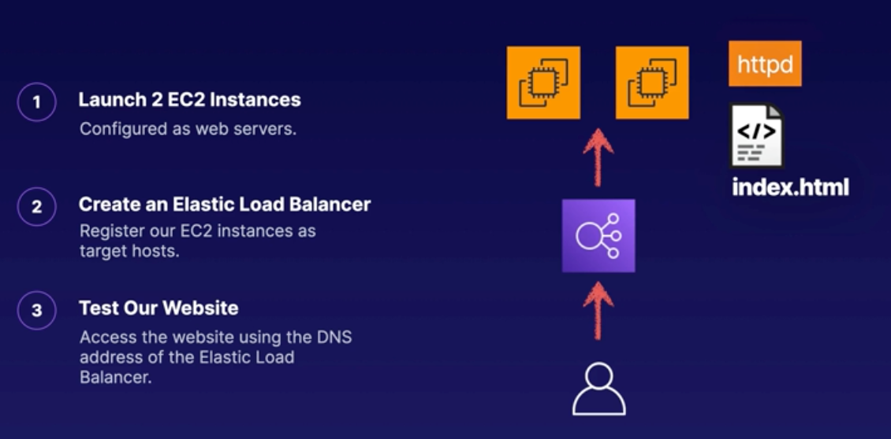

# Deploy Elastic Load Balancer



## Launch 2 EC2 Instances
- Navigate to `EC2` within AWS console
- Select `Launch Instance`
- EC2 instance names:
  - `web-server-1`
  - `web-server-2`
- OS: `AMI2`
- Type: `t3.micro`
- No key pair required
- Network settings:
  - Edit
  - Subnet (different configuration for 2 EC2 isntances): 
    - `web-server-1`: `us-east-1a`
    - `web-server-2`: `us-east-1b`
  - Security group (create new group while creating 1st instance, and later select created group for 2nd instance):
    - `Create New`
    - Name: `my-web-dmz`
    - Inbound security group rules
      - Replace SSH with `HTTP (TCP:80)`
      - Source type `Anywhere`
- Advanced Settings:
  - User data:
    -   ```sh
        #!/bin/bash
        yum update -a
        yum install httpd -y
        echo "<html><body><h1>Hello Cloud Gurus</h1></body></html>" > /var/www/html/index.html
        systemctl start httpd
        systemctl enable httpd
        ```
- `Launch instance`

<br><br>

## Create an Elastic Load Balancer
- Within `EC2 Services` dashboard, scroll down within the menu on the left-hand side and select `Load Balancer`
- Select `Application Load Balancer (ALB)`
- Name: `my-load-balancer`
- Scheme: `Internet-facing`
- IP address type: `IPv4`
- Network Mapping:
  - VPC: default
  - Mapping:
    - [x] us-east-1a
    - [x] us-east-1b
- Security group: 
  - Select `my-web-dmz` (previously created)
  - Remove default security group
- Listener and routing:
  - `Listener HTTP:80`
    - Protocol: `HTTP`
    - Port: `80`
    - Default Action:
      - `Create target group`
      - Target type: `Instances`
      - Target group name: `my-target-group`
      - Protocol: `HTTP:80`
      - VPC: `default`
      - Protocol version: `HTTP1`
      - Health checks:
        - Protocol: `HTTP`
        - Path: `/index.html`
      - Scroll to the bottom and select `Next` (to the `Register targets` screen)
      - Select `web-server-1` and `web-server-2` instances.
      - Confirm the port (e.g. `80`)
      - Select `Include as pending below`
      - Complete target group configuration by selecting `Create target group`
    - In `Listeners and routing` select refresh button, and previously created target group shoud be available for selection in drop-down manu.
- Complete ELB creation by selecting `Create load balancer`


## Test 
- Once the ELB instance goes into `Active` status, open EMB details by selecting instance name
- Copy the DNS name (i.e. `my-load-balancer-48064029.us-east-1.elb.amazonaws.com`)
- Open copied link in the browser window
- You should see the content of bootstrap script diplayed to you `Hello Cloud Gurus`