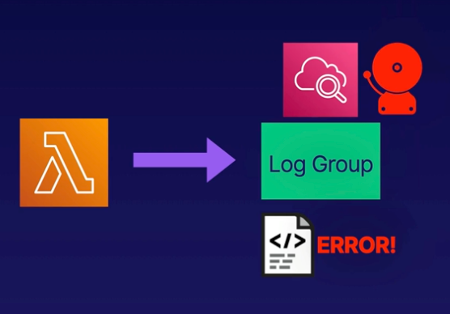

# Demo<br>Creating CloudWatch Metric Filter



<br>

### Lesson Objectives
1. **Create a basic Lambda Function**<br>A new log group is automatically created, enabling it to send logs to CloudWatch.
2. **Test**<br>Test that our function is working, which will generatesome log events.
3. **Explore the options**<br>Explore how to monitor for specific terms or value appearing in our logs.
4. **Create a Metric Filter**<br>Create a metric filter that will cause CloudWatch to alert if any errors appear in the log.


<br><br><br>

<h2>Solution</h2>

## Create a basic Lambda Function
- In Console navigate to `Lambda` and select `Create function`
- Provide the following details in **Create function** page
  - Function type:
    - [x] Author from scratch
    - [ ] Use a blueprint
    - [ ] Container image
  - Function name: `my-lambda-function`
  - Runtime: `Node.js 18.x`
  - Architecture: 
    - [x] `x86_64`
    - [ ] `arm64`
  - All other settings should remain default
  - `Create function`
- On the next configuration screen, navigate to `Code source` and alter content of the `index.mjs` file. Add following code:
  
    ```js
    export const handler = async(event) => {
        // TODO implement
        const response = {
            statusCode: 200,
            body: JSON.stringify('Hello from Lambda');
        };
        return response;
    }
    ```
- Select `Deploy` to save changes

<br>
