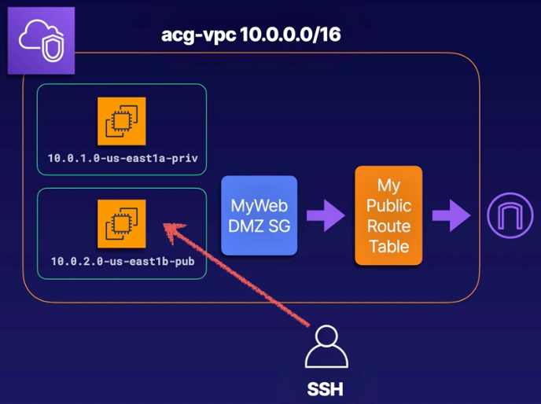

# Demo: Building Your Own Custom VPC

 

## Part 1

 

### Objectives
- **Create a New VPC**:
  - Name: `acg-vpc`
  - CIDR: `10.0.0.0/16`
- **Create a Private Subnet**
  - Name: `10.0.1.0-us-east1a-priv`
- **Create a Public Subnet**
  - Name: `10.0.2.0-us-east1b-pub`
- **Create an Internal Gateway** Attach it to our VPC
- **Configure a Route Table** Route internet traffic to the internet gateway, and associate our public subnet with the route table

 

## Solution
### **1. Create a New VPC**  
1. Open the AWS Management Console and search for **VPC**.  
2. Ensure you are in the **us-east-1** region.  
3. Select **Create VPC**.  
   - Name: `acg-vpc`  
   - CIDR Range: `10.0.0.0/16`  
   - IPv6 CIDR Block: Leave empty.  
   - Tenancy: Select **Default (shared hardware)**.  
4. Click **Create VPC**.  
5. Verify:  
   - A default **route table**, **network ACL**, and **security group** are automatically created.  

 

### **2. Create Subnets**  
1. Go to **Subnets** in the VPC menu.  
2. Click **Create Subnet**.  
3. Select your VPC (`acg-vpc`) at the top.  
4. Create the **Private Subnet**:  
   - Name: `10.0.1.0-us-east1a-priv`  
   - Availability Zone: `us-east-1a`  
   - CIDR Block: `10.0.1.0/24`  
5. Create the **Public Subnet**:  
   - Name: `10.0.2.0-us-east1b-pub`  
   - Availability Zone: `us-east-1b`  
   - CIDR Block: `10.0.2.0/24`  
6. Click **Create Subnet**.  

 

### **3. Add an Internet Gateway**  
1. Go to **Internet Gateways** in the VPC menu.  
2. Click **Create Internet Gateway**.  
   - Name: `my-igw`  
3. Click **Create Internet Gateway**.  
4. Attach the Internet Gateway to your VPC:  
   - Select your gateway and choose **Actions > Attach to VPC**.  
   - Select your VPC (`acg-vpc`) and click **Attach Internet Gateway**.  

 

### **4. Create and Configure a Public Route Table**  
1. Go to **Route Tables** in the VPC menu.  
2. Click **Create Route Table**.  
   - Name: `MyPublicRouteTable`  
   - VPC: Select `acg-vpc`.  
3. Click **Create Route Table**.  

#### **Add a Route to the Internet**  
4. Select your newly created route table.  
5. Choose **Actions > Edit Routes**.  
6. Add a route:  
   - Destination: `0.0.0.0/0` (all IPv4 addresses).  
   - Target: Select your Internet Gateway (`my-igw`).  
7. Click **Save Routes**.  

#### **Associate the Route Table with the Public Subnet**  
8. From the actions dropdown, select **Edit Subnet Associations**.  
9. Select your public subnet (`10.0.2.0-us-east1b-pub`).  
10. Click **Save Associations**.  

 

### **5. Verify Setup**  
- At this stage, you have:  
  - A custom VPC (`acg-vpc`).  
  - One private subnet (`10.0.1.0-us-east1a-priv`).  
  - One public subnet (`10.0.2.0-us-east1b-pub`).  
  - An Internet Gateway (`my-igw`) attached to the VPC.  
  - A public route table (`MyPublicRouteTable`) with a route to the internet, associated with the public subnet.  

   

## Part 2

 

### Objectives
- **Launch EC2 Instances** Launch instances in each of our subnets
- **Configure a Security Group** Allow SSH and HTTP access to our public instance
- **Log in to Our Public Instance** Use SSh to log in

 

## Solution Part 2
### **Modify Public Subnet Settings for Auto-Assign Public IPs**  
1. Open the **AWS Management Console** and search for **VPC**.  
2. Go to **Subnets** and select your **public subnet** (`10.0.2.0-us-east1b-pub`).  
3. Click **Actions > Edit Subnet Settings**.  
4. Enable **Auto-assign public IP**.  
5. Click **Save Changes**.  

 

### **Launch EC2 Instances**  
#### **A. Create the Public EC2 Instance**  
1. Search for **EC2** in the AWS Console.  
2. Click **Launch Instance**.  
3. Configure instance settings:  
   - **Name**: `MyPublicInstance`  
   - **AMI**: Amazon Linux 2  
   - **Instance Type**: `t3.micro`  
   - **Key Pair**: Create a new key pair.  
     - Name: `nvkp`  
     - Download the key to your local machine.  
   - **Network Settings**:  
     - VPC: Select `acg-vpc`.  
     - Subnet: Select the **public subnet**.  
     - Ensure **Auto-assign public IP** is enabled.  
   - **Security Group**:  
     - Create a new security group named `MyWebDMZ`.  
     - Allow **SSH (port 22)** from anywhere.  
4. Click **Launch Instance**.  

#### **Create the Private EC2 Instance**  
1. Return to **EC2** and click **Launch Instance** again.  
2. Configure instance settings:  
   - **Name**: `MyPrivateInstance`  
   - **AMI**: Amazon Linux 2  
   - **Instance Type**: `t3.micro`  
   - **Key Pair**: Use the same key pair (`nvkp`) created earlier.  
   - **Network Settings**:  
     - VPC: Select `acg-vpc`.  
     - Subnet: Select the **private subnet** (`10.0.1.0-us-east1a-priv`).  
     - Ensure **Auto-assign public IP** is disabled.  
   - **Security Group**:  
     - Create a new security group named `MyPrivateSG`.  
     - Remove **SSH** access. Leave the security group without any rules for now.  
3. Click **Launch Instance**.  

 

### **Verify Instance Launch**  
1. Go to the **Instances** page in the EC2 menu.  
2. Wait for both instances (`MyPublicInstance` and `MyPrivateInstance`) to initialize.  
3. Verify:  
   - The **public instance** has a public IP address.  
   - The **private instance** does not have a public IP.  
