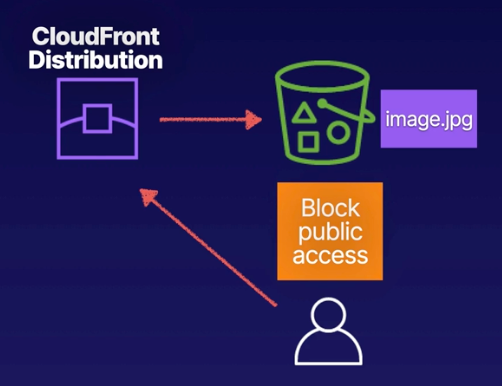

# Demo:<br>Configuring Amazon CloudFront with Origin Access Control

<br>



<br>

### Objectives
- **Create an S3 Bucket**<br>Enable public access and upload an image to the bucket
- **Create a CloudFront Distribution**<br>Test the distribution is working
- **Remove Public Access**<br>Remove public read access from our bucket
- **Create an Origin Access Control**<br>Add the Origin Access Control to our CloudFront Origin

<br><br>

## Solution
## S3 configuration
### **Create S3 Bucket**:
   - From the AWS Management Console, create a bucket (e.g., `my-cf-origin-random-numbers`).
   - Disable "Block public access" during bucket creation.
   - Acknowledge and confirm changes.

### **Update Bucket Policy for Public Access**:
   - Add a policy to allow public access to the bucket.
   - Replace placeholders like `<bucket-name>` with the actual bucket name.
   - Example policy structure:
     ```json
     {
       "Version": "2012-10-17",
       "Statement": [
         {
           "Effect": "Allow",
           "Principal": "*",
           "Action": "s3:GetObject",
           "Resource": "arn:aws:s3:::my-cf-origin-random-numbers/*"
         }
       ]
     }
     ```

### **Upload Content**:
   - Upload an image file (e.g., `ryan_faye.jpeg`) to the bucket.

<br>

### **Create CloudFront Distribution**:
   - Configure CloudFront with the S3 bucket as the origin.
   - Accept default settings for caching and distribution.
   - Wait for the distribution to deploy.

### **Test CloudFront Distribution**:
   - Access the file using the CloudFront domain URL (e.g., `https://<cloudfront-domain>/ryan_faye.jpeg`).

<br>

### **Remove Public Access from S3**:
   - Re-enable the "Block public access" settings for the bucket.
   - Update the bucket policy to allow access only to the CloudFront distribution:
     - Replace `<bucket-name>` with the bucket name.
     - Replace `<cloudfront-arn>` with the ARN of the CloudFront distribution.
     - Example policy:
       ```json
       {
         "Version": "2012-10-17",
         "Statement": [
           {
             "Effect": "Allow",
             "Principal": {
               "Service": "cloudfront.amazonaws.com"
             },
             "Action": "s3:GetObject",
             "Resource": "arn:aws:s3:::my-cf-origin-random-numbers/*",
             "Condition": {
               "StringEquals": {
                 "AWS:SourceArn": "<cloudfront-arn>"
               }
             }
           }
         ]
       }
       ```

### **Create Origin Access Control (OAC)**:
   - In CloudFront, navigate to **Origin Access** and create a new OAC.
   - Name the OAC (e.g., `My OAC`) and accept the default settings.

### **Update CloudFront with OAC**:
   - Edit the origin settings of the CloudFront distribution to use the new OAC.
   - Save the changes and wait for the distribution to deploy.
