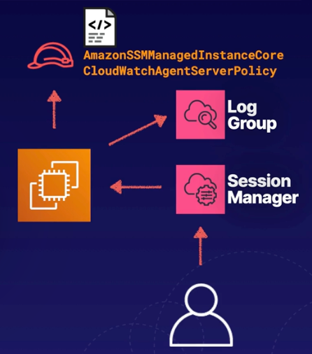

# Demo: Connecting to an EC2 Instance Using systems Manager Session Manager

 

 

### Objectives
- **Create an IAM Role** Create a role with permissions to communicate with Session Manger and CloudWatch:
  - `AmazonSSManagedInstanceCore`
  - `CloudWatchAgentServerPolicy`
- **Launch an EC2 Instance** Associate the instance with the IAM role
- **Configure a CloudWatch Log Group** This will allow us to our sessions
- **Connect to the EC2 Instance** Use Session Manager to connect to the instance and review the session logs

   

## Solution
### **1. Create an IAM Role for Session Manager**
1. **Navigate to IAM**:
   - Go to the AWS Management Console and search for **IAM**.
2. **Create a Role**:
   - Select **Roles** > **Create Role**.
   - Choose **AWS Service** as the trusted entity and **EC2** under Common Use Cases.
3. **Attach Policies**:
   - Search and attach the following policies:
     - **AmazonSSMManagedInstanceCore**: Enables communication between the EC2 instance and Session Manager.
     - **CloudWatchAgentServerPolicy**: Allows EC2 to send logs to CloudWatch.
4. **Finalize Role**:
   - Name the role (e.g., `SSM-CloudWatch-Role`), review attached policies, and create the role.

 

### **2. Launch an EC2 Instance**
1. **Launch the Instance**:
   - Go to the **EC2 Dashboard** and click **Launch Instance**.
   - Name the instance and select **Amazon Linux AMI** as the OS.
   - Choose instance type: **t3.micro**.
2. **IAM Role**:
   - Under **Advanced Details**, select the IAM role you created earlier.
3. **Network Settings**:
   - Ensure **Auto-assign Public IP** is enabled.
   - Remove the SSH rule from the security group, as SSH is not required.
4. **Key Pair**:
   - Select **Proceed Without a Key Pair** since Session Manager doesn’t require SSH.
5. **Launch**:
   - Launch the instance.

 

### **3. Configure a CloudWatch Log Group**
1. **Go to CloudWatch**:
   - Navigate to **CloudWatch** > **Log Groups**.
2. **Create a Log Group**:
   - Name the log group (e.g., `SSM-Session-Logs`).
   - Optionally, configure encryption using a KMS key.
   - Create the log group.

 

### **4. Configure Session Manager for CloudWatch Logging**
1. **Navigate to Systems Manager**:
   - In the AWS Console, search for **Systems Manager**.
2. **Enable Logging**:
   - Under **Session Manager** > **Preferences**, select **Edit**.
   - Enable **CloudWatch logging**.
   - Choose the CloudWatch log group created earlier.
   - Deselect encryption if the log group is not encrypted.
   - Save changes.

 

### **5. Connect to the EC2 Instance**
1. **Start Session**:
   - In **Session Manager**, go to **Sessions** > **Start Session**.
   - Select the EC2 instance as the target and start the session.
2. **Run Commands**:
   - Example commands to run during the session:
     - `whoami`: Verify the user (`ssm-user`).
     - `pwd`, `ls`, `df -k`: Explore the filesystem.
     - `ps -ef`: List running processes.
3. **End Session**:
   - Type `exit` to terminate the session.

 

### **6. Review Session Logs in CloudWatch**
1. **View Session History**:
   - Go to **Session Manager** > **Session History** to view past sessions.
2. **Access Logs**:
   - Click the output location link to navigate to **CloudWatch Logs**.
3. **Inspect Logs**:
   - Each event has a timestamp, region, instance details, and commands with outputs.
   - Review commands and outputs logged under **Session Data**.

 

#### **Benefits of Using Session Manager**
1. **No SSH Required**:
   - No need for SSH keys, bastion hosts, or associated security group rules.
2. **Secure and Encrypted**:
   - Uses TLS encryption.
   - Logs can be encrypted using a KMS key and stored in CloudWatch or S3.
3. **Centralized Management**:
   - Browser-based access to EC2 instances with PowerShell or Bash.
   - Manage Linux, Windows, or even on-premises systems.
4. **Logging**:
   - Enables keystroke and session logging for auditing and monitoring purposes.

