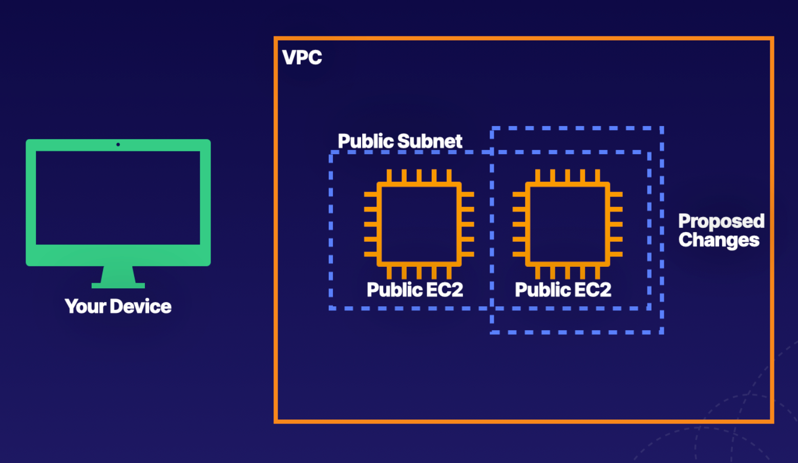

# Create and Secure an EC2 Instance

### Introduction
You have received approval to create a new EC2 instance that is accessible only to you, so you are able to test your scripts and use them for learning goals set by your team lead. You will create an EC2 instance and allow for access only from your machine. You will then test this access to ensure that you have configured access correctly.

## Solution

## Configure a Security Group

1. In the search bar at the top of the AWS portal, type and select `EC2`.
2. Click `Instances (running)` and confirm that you see `PublicInstance` is a `t3.micro`.
3. On the left side under `Network & Security`, click `Security Groups`.
4. In the upper right corner, click `Create security group`.
5. Under `Basic Details`, set the following values:
    - `Security group name`: Type ***SG1***.
    - `Description`: Type ***my instance***.
    - `VPC`: Leave at ***default***.
6. Under `Inbound rules`, click `Add rule` and set the following values:
    - `Type`: Click on the dropdown menu and select ***SSH***.
    - `Source`: Click on the dropdown menu and select ***My IP***.
7. Leave the other settings at default, scroll down, and click `Create security group`.

  

## Create an EC2 Instance

1. On the left side under `Instances`, click `Instances`.
2. In the upper right corner, click `Launch instances`.
3. Under `Name and Tags`, enter **My Instance** as the instance name.
4. Under `Application and OS Images (Amazon Machine Image)`, ensure **Amazon Linux AMI** is selected.
5. Under `Instance type`, click on the dropdown menu and select **t3.micro**.
6. Under `Key pair (login)`, click **Create new key pair**.
7. In the `Create key pair` pop-up menu, enter **keypair1** as the key pair name.
8. Leave the other settings at default and click `Create key pair` (you should see your key pair in your Downloads folder).
9. Next to `Network settings` , click **Edit**.
10. `Auto-assign public IP`, click on the dropdown menu and select **Enable**.
11. Under `Firewall (security groups)`, choose **Select existing security group**.
12. Under `Common security group`, select the **SG1** security group you just created.
13. Under `Summary`, click **Launch instance**.
14. Once the instance has launched, click `View all instances`.
15. At the top of the page in the toolbar, click on the refresh icon. You should see **My Instance initializing**. It may take a few minutes to run.

  

## Test Access to the EC2 Instance

1. Click on the `My Instance` instance ID to navigate into the instance.
2. In the upper right corner under `Private IPv4 addresses`, copy the listed private IP address.
3. Paste the IP address in a separate text document. You'll need it later.
4. Under `Public IPv4 address`, copy the listed public IP address (paste the IP address in a separate text document, as well).
5. In the breadcrumb trail at the top left, click `Instances`.
6. Click on the checkbox next to `PublicInstance`.
7. In the upper right corner, click `Connect`.
8. Under User name, **delete root** and enter **cloud_user**.
9. Click `Connect`.

  

## Try to Access Your Machine from One of the Other Instances

- Connect to My Instance (you'll need the private IP address copied earlier):

    `ssh ec2-user@<PRIVATE_IP_ADDRESS>`

    > **Note**:
    > This will take a few minutes, but the connection will time out. Access to the new instance should be locked down to only your machine. No other instances should be able to access that instance.

  

## Try to Access the New Instance from Your Machine

1. Navigate to your Downloads folder:

    `cd /Users/<USERNAME>/Downloads/`

2. Set permissions to read only:

    `chmod 400 keypair1.pem`

3. Ensure permissions change was successful:

    `ls -al | grep key keypair1.pem`

4. Connect to (you'll need the public IP address copied earlier):

    `ssh -i /Users/<USERNAME>/Downloads/keypair1.pem ec2-user@<PUBLIC_IP_ADDRESS>`

5. You may get a prompt confirming access. If so, type `yes`.

6. You should successfully connect to the instance.

