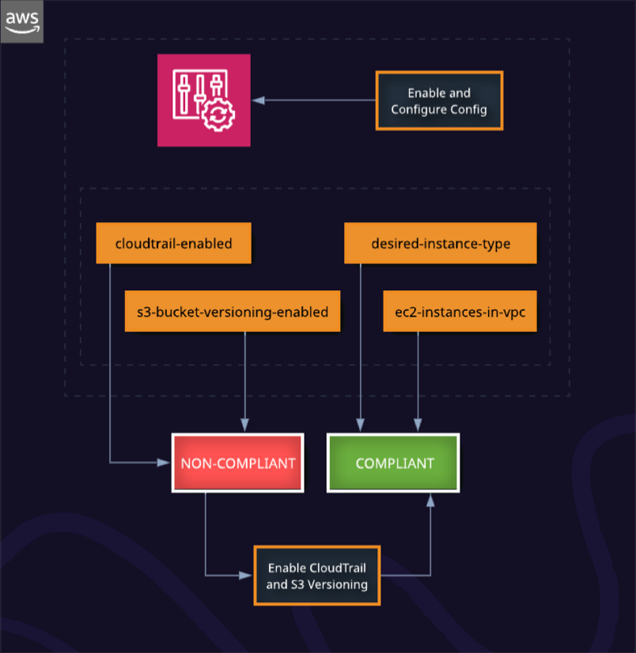

# Auditing Resource Compliance with AWS Config

### ABOUT THIS LAB
In this hands-on lab, we'll implement AWS Config rules and use AWS Config for compliance auditing and remediation. We will configure compliance rules for evaluating the EC2 instance type, whether S3 versioning is enabled, EC2 instances in a VPC, and whether CloudTrail is enabled. These rules will give us firsthand knowledge of how the AWS Config service works. We will then explore the configuration management aspect of AWS Config.

 

### OBJECTIVES
- Enable AWS Config
- Configure Rules for Resources
- Configure the Non-Compliant Resources to Comply
- Reevaluate the Non-Compliant Rules in AWS Config

 

   

## Solution

### Enable AWS Config
1. Use the Services menu to navigate to **Management & Governance**, and then select **Config**.
2. On the right, click **Get started**.
3. Leave the default general settings and click **Next**.
4. Leave the **AWS Managed Rules** section blank and click **Next**.
5. Review your **Config** settings and then click **Confirm**. 
Your **S3 bucket** is successfully created, and **Config** is discovering all the resources available in your environment. This may take a few minutes.
6. After **Config** is successfully signed up, click **View dashboard** in the banner across the top of the page.
7. Once on the dashboard, notice that you may already have a rule set up. The name of this rule is `approved-amis-by-id` (but it may have another name).
8. In the **AWS Config** sidebar menu, select **Rules**.
9. Select the automatically created rule.
10. Click **Actions** > **Delete**.
11. In the confirmation pop-up window, type `confirm` and then click **Delete**.

 

### Configure Rules for Resources

#### Create the `cloudtrail-enabled` Rule
1. Click **Add rule**.
2. Specify the rule type:
    - Select rule type: Ensure that `Add AWS managed rule` is selected.
    - `AWS Managed Rules`: Use the rules search bar to search for `CloudTrail`, and then select the `cloudtrail-enabled rule`.
3. Click **Next**.
4. Leave the default **Configure rule** settings and click **Next**.
5. Review the rule details and then click **Save**.

 

### Create the `desired-instance-type` Rule
1. On the right, click `Add rule`.
2. Specify the rule type:
    - Select rule type: Ensure that `Add AWS managed rule` is selected.
    - `AWS Managed Rules`: Use the rules search bar to search for `desired`, and then select the `desired-instance-type` rule.
3. Click **Next**.
4. On the Configure rule page, fill in the Parameters section:
    - Key: `Ensure the instanceType key is available`.
    - Value: In the text field, enter `t2.micro`.
5. Click **Next**.
6. Review the rule details and then click **Save**.

 

### Create the `ec2-instances-in-vpc` Rule
1. On the right, click `Add rule`.
2. Specify the rule type:
    - Select rule type: Ensure that `Add AWS managed rule` is selected.
    - `AWS Managed Rules`: Use the rules search bar to search for `ec2-instances`, and then select the `ec2-instances-in-vpc` rule.
3. Click **Next**.
4. Get your VPC ID:
    - Use the Services menu to navigate to `Networking & Content Delivery`, and then open `VPC` in a new browser tab.
    - From the **VPC Management Console**, select **VPCs**.
    - Check the checkbox to the left of the provided VPC.
    - From the VPC details, **copy the VPC ID**.
5. Navigate back to the **AWS Config Console** browser tab.
6. On the Configure rule page, fill in the Parameters section:
    - Key: `Ensure the vpcId key is available`.
    - Value: In the text field, paste in your **copied VPC ID**.
7. Click **Next**.
8. Review the rule details and then click `Save`.

 

### Create the `s3-bucket-versioning-enabled` Rule
1. On the right, click **Add rule**.
2. Specify the rule type:
    - Select rule type: Ensure that `Add AWS managed rule` is selected.
    - `AWS Managed Rules`: Use the rules search bar to search for `s3-bucket-versioning`, and then select the `s3-bucket-versioning-enabled` rule.
3. Click **Next**.
4. Leave the default Configure rule settings and click **Next**.
5. Review the rule details and then click **Save**.
 
  

> After a few minutes, you should see that all the rules are evaluated. The `ec2-instances-in-vpc` and `desired-instance-type` rules are compliant, while the `s3-bucket-versioning-enabled` and **cloudtrail-enabled** rules are noncompliant.

 

### Configure the Non-Compliant Resources to Comply
1. Open **CloudTrail** in a new browser tab.
2. In the **CloudTrail** sidebar menu, select **Trails**.
3. On the right, click `Create trail`.
4. Fill in the trail details:
   - **Trail name**: In the text field, enter `ConfigTrail`.
   - **Storage location**: Ensure that `Create new S3 bucket` is selected.
   - Log file `SSE-KMS encryption`: **Uncheck the Enabled checkbox**.
5. Leave all the other default settings and click `Next`.
6. Ensure the Choose log events settings are configured correctly:
   - **Event type**: Ensure that only `Management events` is selected.
   - **API activity**: Ensure that only Read and Write are selected.
7. Click `Next`.
8. Review your trail details and then click `Create trail`.
9. Go back to the Config console, and refresh the page.
10. Open the `cloudtrail-enabled` rule.
11. Click `Actions` > `Re-evaluate`. The re-evaluation will take a few minutes.
12. Once complete, click `Rules` in the breadcrumb navigation at the top.
13. Observe the `cloudtrail-enabled` rule is now compliant.

 
