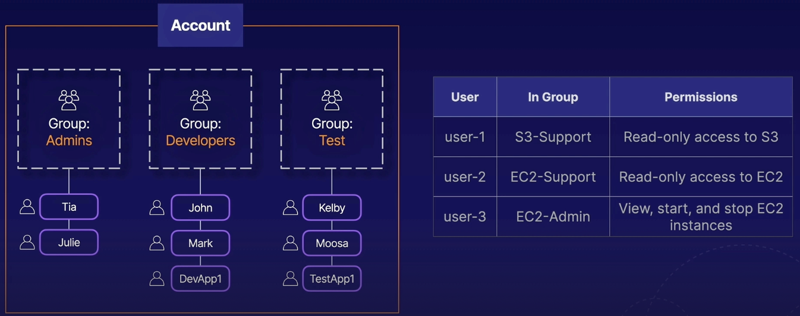

# Introduction to AWS Identity and Access Management (IAM)

### ABOUT THIS LAB
AWS Identity and Access Management (IAM) is a service that allows AWS customers to manage user access and permissions for their accounts, as well as available APIs/services within AWS. IAM can manage users and security credentials (such as API access keys), and allow users to access AWS resources.
In this lab, we will walk through the foundations of IAM. We'll focus on user and group management, as well as how to assign access to specific resources using IAM-managed policies. We'll learn how to find the login URL, where AWS users can log in to their account, and explore this from a real-world use case perspective.

### Learning Objectives
- **Add the Users to the Proper Group**
    - `user-1` should be in the `S3-Support` group.
    - `user-2` should be in the `EC2-Support` group.
    - `user-3` should be in the `EC2-Admin` group.
- **Use the IAM Sign-in Link to Sign In as user**
  - Copy the IAM user sign-in link in the AWS console, open an incognito window, and sign in as `user-1`, `user-2`, and `user-3` with the passwords provided on the lab page.

   

## Solution
## Explore Users and Groups Walkthrough
### Explore the Users
1. Navigate to `IAM`.
2. In the IAM sidebar menu, select `Users`.
3. Select the `user-1` user name.
4. Review the resources associated with user-1:
    - Select the `Permissions` and `Groups` tabs, where you'll see user-1 does not have any permissions assigned and does not belong to any groups.
    - Select the `Security credentials` tab, where you would see user access keys, SSH public keys, and HTTPS Git credentials for AWS CodeCommit.
    - Select the `Access Advisor` tab to see which services the user has accessed and when.
5. At the top of the page, under `Summary`, observe the user’s ARN (Amazon Resource Name), path, and creation time.

 

### Explore the Groups
1. In the IAM sidebar menu, select `User groups`. You should see three provided user groups for this lab:
    - `EC2-Admin`: Provides permissions to view, start, and stop EC2 instances
    - `EC2-Support`: Provides read-only access to EC2
    - `S3-Support`: Provides read-only access to S3
2. Select the `EC2-Admin` group name.
3. Review the resources associated with EC2-Admin:
    - Select the `Permissions` tab, where you can see that there is an inline policy associated with the group.
    - Click the `plus-sign icon` to the left of the policy name to view the associated inline policy.
4. Use the breadcrumb navigation along the top of the page to select `User groups`.
5. Repeat for `EC2-Support` and `S3-Support` groups

   
