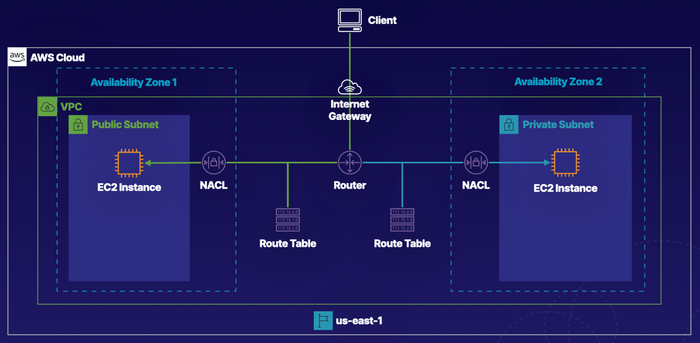

# Creating a Basic VPC and Associated Components in AWS

### About this lab
AWS networking consists of multiple components, and understanding the relationship between the networking components is a key part of understanding the overall functionality and capabilities of AWS. In this hands-on lab, we will create a VPC with an internet gateway, as well as create subnets across multiple Availability Zones.

 

 

### Objectives
1. Create a VPC
2. Create a Public and Private Subnet in Different Availability Zones
3. Create Two Network Access Control Lists (NACLs), and Associate Each with the Proper Subnet
4. Create an Internet Gateway, and Attach It to the VPC
5. Create Two Route Tables, and Associate Them with the Correct Subnet

   

## Solution
## **Create a VPC**
1. Navigate to **VPC**.
2. Click `Create VPC`.
3. For **Resources to create**, select `VPC only`.
4. Configure the VPC settings:
    - Name tag: In the text field, enter `VPC1`.
    - IPv4 CIDR: In the text field, enter `172.16.0.0/16`.
5. Leave the other settings as the defaults and click `Create VPC`. 
The VPC is created but does not have an internet gateway, subnets, or any other functionality.

 

## **Create an Internet Gateway, and Attach It to the VPC**
1. In the sidebar menu, navigate to **Virtual private cloud** and select `Internet gateways`.
2. On the right, click `Create internet gateway`.
3. In the Name tag field, enter `IGW`.
4. Click `Create internet gateway`.
5. After the internet gateway is created, use the **Actions dropdown** to select `Attach to VPC`.
6. In the **Available VPCs** field, select `VPC1`.
7. Click `Attach internet gateway`. Your internet gateway should now be in an Attached state.

 
