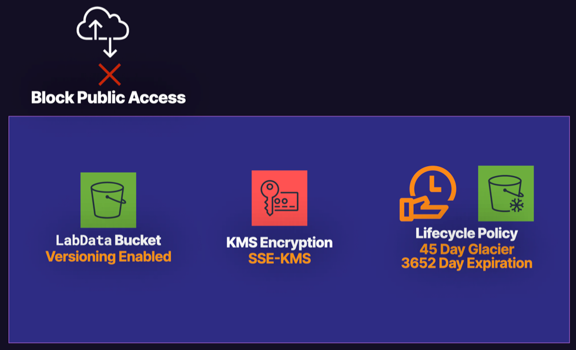

# Configuring S3 Buckets for Versioning and Deletion Protection

 

 

### ABOUT THIS LAB
In this lab, students will work with Amazon Simple Storage Service (S3) to configure two S3 buckets with encryption, versioning, lifecycle rules, and deletion protection.

 

### Objectives
- Configure Two S3 Buckets
- Configure Protection for Accidental Deletion of Data for Both Buckets
- Configure KMS Encryption for the labdata Bucket
- Configure Lifecycle Configuration for Both Buckets

 

## Solution
## Configure an S3 Buckets
1. Navigate to `S3` using the Services menu or the unified search bar.
2. On the right, click `Create bucket`.
3. In the Bucket name field, enter a globally unique name that begins with labdata and ends in a string of random characters (e.g., **labdata12345**).
4. Leave all other default settings and click `Create bucket` at the bottom of the page. The bucket is created.

 

## Configure Protection for Accidental Deletion of Data for the Bucket
1. From the `Buckets` page, select your labdata bucket name.
2. Select the `Properties` tab. Note that bucket versioning is currently disabled.
3. In the `Bucket Versioning` section, click `Edit`.
4. Select `Enable`.
5. Click `Save changes`. Versioning and deletion protection are now enabled on the bucket.

 

## Configure KMS Encryption for the `labdata` Bucket

### Create a KMS Encryption Key
1. In the search bar on top, enter `kms`.
2. From the search results, select `Key Management Service` and open it in a new browser tab.

You may need to exit out of some AccessDenied requests on top of the page.
3. Click `Create key` on the right.
4. On the **Configure key** page, leave the default settings and click `Next`.
5. On the **Add labels** page, enter `labkms` in the Alias field and click `Next`.
6. On the **Key administrators** page, select `cloud_user` and click `Next`.
7. On the **Permissions** page, select cloud_user again and click `Next`.
8. Review your key details and then click `Finish`.

 

### Apply KMS Encryption
1. Navigate back to the `S3` tab. You should still be in the `Properties` tab of your S3 bucket.
2. In the `Properties` tab, scroll down to the `Default encryption` section and note that default encryption is currently **disabled**.
3. In the `Default encryption` section, click `Edit` on the right.
4. Configure your default encryption settings:
    - **Encryption type**: Select `Server-side encryption with AWS Key Management Service keys (SSE-KMS)`.
    - **AWS KMS key**: Select `Choose from your AWS KMS keys`.
    - **Available AWS KMS keys**: Use the dropdown menu to select the key you created.
    - **Bucket Key**: Ensure `Enable` is selected.
5. Click `Save changes`. Your encryption settings are saved and you are automatically returned to the Properties tab of your labdata bucket.
6. Scroll down to the `Default encryption section` and confirm that encryption is enabled and that it's using the KMS key you created.

 

### Configure Lifecycle Configuration for the Bucket
1. Select the `Management` tab.
2. In the `Lifecycle rules` section, click `Create lifecycle rule`.
3. Fill in the Lifecycle rule configuration:
    - **Lifecycle rule name**: In the text box, enter `lifecycle`.
    - **Choose a rule scope**: Select `Apply to all objects in the bucket` and then check the acknowledgement checkbox.
4. Configure the first lifecycle rule action:
    - **Lifecycle rule actions**: Check the `Move current versions of objects between storage classes` checkbox.
    - **Choose storage class transitions**: Use the dropdown menu to select `Glacier Flexible Retrieval`.
    - **Days after object creation**: In the text box, enter `45`.
5. After configuring the lifecycle action rule, check the acknowledgement checkbox that displays.
6. Configure the second lifecycle rule action:
    - **Lifecycle rule actions**: Check the `Expire current versions of objects` checkbox.
    - **Days after object creation**: In the text box, enter `3652 (10 years)`.
7. Review your actions and click `Create rule`.

> On day 0, you should have objects uploaded. 
> 
> On day 45, you should have objective move to Glacier Flexible Retrieval. 
> 
> On day 3652, you should have objects expire.
